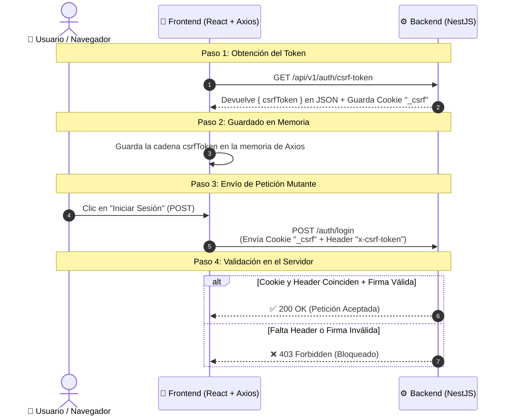

# 🛡️ Guía Simple: Protección CSRF (Cross-Site Request Forgery)

Esta guía explica en palabras simples qué es el token **CSRF**, por qué es necesario y cómo funciona el flujo de seguridad en nuestra aplicación full-stack.

---

## ❓ 1. ¿Qué es CSRF y qué problema resuelve?

### ⚠️ El Problema (Sin Protección CSRF):
Como nuestra aplicación guarda la sesión en **Cookies HTTP-Only**, el navegador envía esas cookies **automáticamente** en cada petición hacia el backend.

Si visitas un sitio malicioso (ej: `sitio-malicioso.com`), esa página podría enviar una petición oculta a nuestro backend (por ejemplo: `POST /users/delete`). Como el navegador adjunta tus cookies automáticamente, **el servidor pensaría que fuiste tú quien hizo clic** y ejecutaría la acción.

### 🛡️ La Solución (Token CSRF):
La protección CSRF agrega un **"llave o boleto secreto" (Token CSRF)** que **el navegador NO puede enviar automáticamente**. 

Para que el servidor acepte cualquier petición que modifique datos (`POST`, `PUT`, `PATCH`, `DELETE`), la petición debe llevar **dos cosas al mismo tiempo**:
1. La Cookie del navegador.
2. El Token CSRF en los encabezados HTTP enviados por nuestro código Frontend.

---

## 🔄 2. El Flujo de Trabajo en 4 Pasos Simples



---

## 🧩 3. ¿Cómo valida el Backend?

Cada vez que haces clic en un botón que envía o modifica datos (`POST`, `PUT`, `DELETE`), el servidor recibe 2 cosas:

| Elemento | ¿Cómo se envía? | ¿Quién lo envía? |
| :--- | :--- | :--- |
| **1. Cookie `_csrf`** | Automático en encabezados Cookie | El Navegador |
| **2. Encabezado `x-csrf-token`** | Manual en encabezado HTTP personalizado | Axios (Interceptor del Frontend) |

### La Regla del Backend:
```text
¿El valor de la Cookie "_csrf" es IGUAL al valor del Encabezado "x-csrf-token"?
  ├── SÍ ➔ Comprueba la firma criptográfica HMAC ➔ ✅ Deja pasar la petición
  └── NO ➔ ❌ Bloquea la petición con Error HTTP 403 Forbidden
```

---

## 🔒 4. ¿Por qué un atacante no puede burlar esto?

Si entras a un sitio malicioso e intenta enviar una petición a tu backend:

1. El navegador del atacante enviará la cookie `_csrf` automáticamente.
2. **PERO el sitio malicioso NO PUEDE leer el valor de tu cookie** debido a las reglas de seguridad del navegador (*Same-Origin Policy*).
3. Como no puede leer la cookie, **el atacante no sabe qué poner en el encabezado `x-csrf-token`**.
4. Al llegar la petición al backend sin el encabezado correcto, la comparación falla y el servidor **bloquea el ataque de inmediato**.

---

## 💻 5. Resumen de la Implementación en Código

### Backend (NestJS):
* **`main.ts`**: Activa el middleware global `app.use(doubleCsrfProtection)`.
* **`auth.controller.ts`**: Expone el endpoint `GET /auth/csrf-token` que emite el token.

### Frontend (React):
* **`useAuthInit.ts`**: Solicita `GET /auth/csrf-token` al iniciar la aplicación.
* **`apiService.ts`**: Axios captura automáticamente el token en memoria y le pega el encabezado `x-csrf-token` a todas las peticiones `POST`, `PUT`, `PATCH` y `DELETE`.
